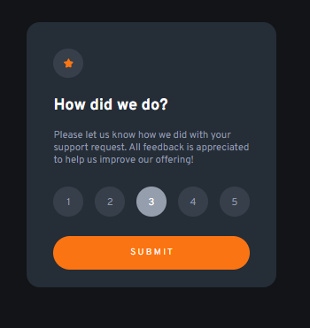

# Frontend Mentor - Interactive rating component solution

This is my solution to the [Interactive rating component challenge on Frontend Mentor](https://www.frontendmentor.io/challenges/interactive-rating-component-koxpeBUmI). 

## Table of contents

- [Overview](#overview)
  - [The challenge](#the-challenge)
  - [Screenshot](#screenshot)
  - [Links](#links)
- [My process](#my-process)
  - [Built with](#built-with)
  - [What I learned](#what-i-learned)
- [Author](#author)

## Overview

### The challenge

Users are be able to:

- View the optimal layout for the app depending on their device's screen size
- See hover states for all interactive elements on the page
- Select and submit a number rating
- See the "Thank you" card state after submitting a rating

### Screenshot

This is a screenshot of main page: ,
This is a screenshot of active main page: ,
and this is a screenshot response (thank you!) page: 

### Links

- Solution URL: [https://github.com/Aleqsa123/interactive-ratinge]
- Live Site URL: [https://aleqsa123.github.io/interactive-rating/]

## My process

### Built with

- Semantic HTML5 markup
- CSS custom properties
- Flexbox
- CSS Grid
- Mobile-first workflow
- [React](https://reactjs.org/) - JS library

### What I learned

This was great challenge, as I learned a lot. First and foremost I learned render a new component frome a component, also send daTa with prop from the main app. Working with useState hook was challenging, selecting and toggling "li" items was very timeconsuming but al last I did it. 

### Continued development

I have to constinue working on the abovementiond challanges, and then take new ones.

## Author

- Github - [Aleqsa123](https://github.com/Aleqsa123)
- Linkedin - [Aleksi Merebashvili](https://www.linkedin.com/in/aleksi-merebashvili-36627426/)
- Facebook - [Aleksi Merebashvili](https://www.facebook.com/aleksi.merebashvili)
- Frontendmentor - [Aleqsa123] (https://www.frontendmentor.io/profile/Aleqsa123)